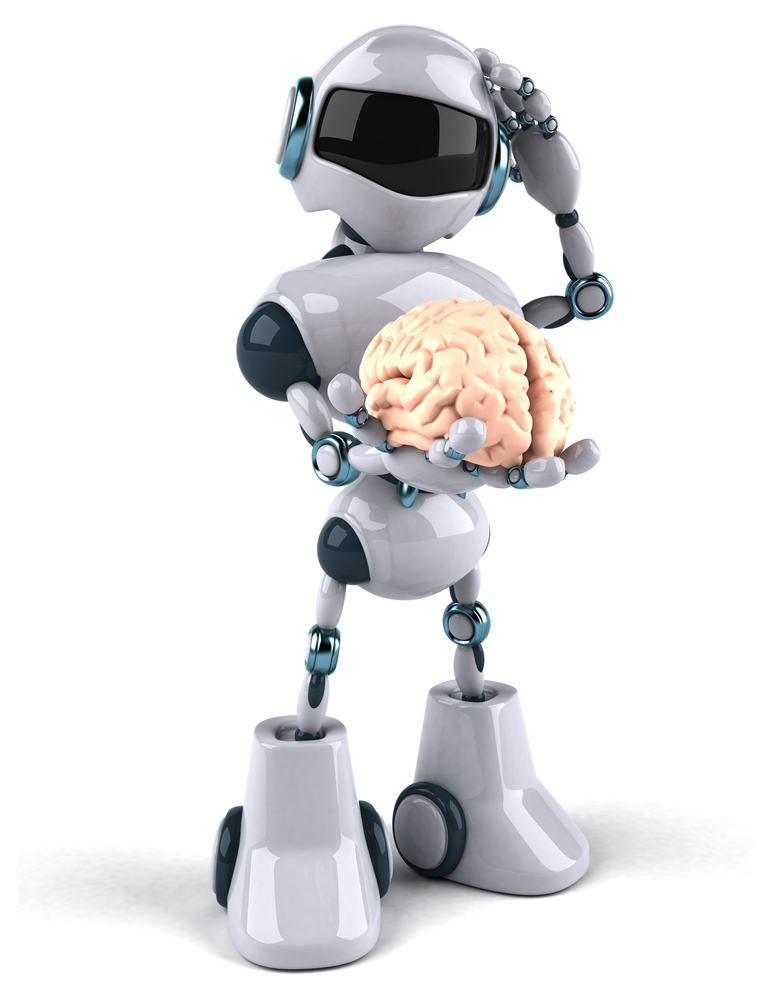
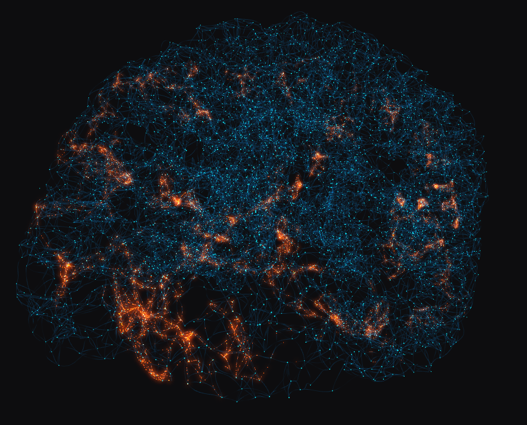
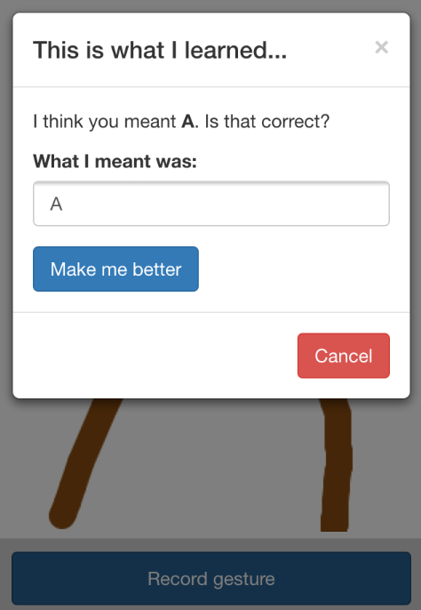

title: YYCjs - Back To The Future
output: index.html
theme: theme
controls: false
logo: theme/logo.png

--

<h1 style="position: absolute; top: 30%; color: white; text-align: center; margin: 0 auto; display: block;">YYCJS presents: Back To The Future</h1>

<div style="width: 100%; background: url(img/back_to_the_future.jpg); height: 100%; background-size: contain; background-repeat: no-repeat; background-position: center;"></div>

--

# Brought to you by

-- presenter


## Eric Kryski

* [<i class="fa fa-github"></i> ekryski](https://github.com/ekryski)
* [<i class="fa fa-twitter"></i> @ekryski](http://twitter.com/ekryski)
* [<i class="fa fa-home"></i> erickryski.com](http://erickryski.com)

-- presenter


## Kevin Barabash

* [<i class="fa fa-github"></i> kevinb7](https://github.com/kevinb7)

-- presenter


## David Luecke

* [<i class="fa fa-github"></i> daffl](https://github.com/daffl)
* [<i class="fa fa-twitter"></i> @daffl](http://twitter.com/daffl)

-- sponsors

# Our Sponsors


--

# Last year

- [JavaScript - The weird parts](https://medium.com/@daffl/javascript-the-weird-parts-8ff3da55798e)
- [jQuery 202 and web components](http://yycjs.com/jquery-202-and-web-components/#slide1)
- [NodeJS like a boss](http://yycjs.com/nodejs-like-a-boss/)
- [Optimize your JS workflows](http://yycjs.com/js-workflow/)
- [Use a framework?](http://yycjs.com/use-a-framework/)
- [JavaScript all the tests](https://github.com/yycjs/js-all-the-tests)
- [Intro to FRP & Scaling NodeJS](http://www.meetup.com/yyc-js/events/209289532/)
- [Intro to Ember and Appcelerator](http://www.meetup.com/yyc-js/events/217284622/)

--

# This year

* YYCJS developer survey ([2014](https://docs.google.com/a/neyeon.com/forms/d/1H6voK4NOBdV1Q-0HcWPPfAGHWZYHBJGhthcO0bFabI4/viewanalytics), [2015](https://docs.google.com/a/neyeon.com/forms/d/1ySTgv1zF3oyQ2BOZS1wckPezO4ZQfeMzxJtGSy_Ic_o/viewanalytics))
* Similar general curriculum
* We are going to be putting together swag packages
* Job board
* Special events
  * January 31st - [The HTML500 is coming to Calgary](http://www.thehtml500.com/cities/calgary)
  * February - Beyond HTML500
  * April - Full day workshop (topic TBD)
  * June - Development for non developers
  * Ideas?

--

# Artificial Intelligence



>  "the science and engineering of making intelligent machines"

--

# What's out there?

--

<div style="width: 100%; background: url(img/machine-learning.jpg); height: 100%; background-size: contain; background-repeat: no-repeat; background-position: center;"></div>

--

<div style="width: 100%; background: url(img/jibo.png); height: 100%; background-size: contain; background-repeat: no-repeat; background-position: center;"></div>

--

## [JIBO](http://www.myjibo.com/) - The world's first family robot


- Developed by Cynthia Lynn Breazeal, director of the "Personal Robot Group" at MIT
- Top 5 funded campaign on Indigogo
- Combines research in machine-human interaction with technologies like voice- and face recognition, spoken language and behaviour driven machine learning

--

<div style="width: 100%; background: url(img/google-self-driving.jpg); height: 100%; background-size: contain; background-repeat: no-repeat; background-position: center;"></div>

--

## Google Translate Android app


--

## [Skype translator](http://www.skype.com/en/translator-preview/)

<iframe style="width: 80%; height: 70%; margin: 0 auto; display: block;" src="//www.youtube.com/embed/YvUk4EBV2FI" frameborder="0" allowfullscreen></iframe>

--

<div style="width: 100%; background: url(img/ibm_watson.png); height: 100%; background-size: contain; background-repeat: no-repeat; background-position: center;"></div>

--

## [IBM Watson](http://www.ibm.com/smarterplanet/us/en/ibmwatson/)

Watson is an artificially intelligent computer system capable of answering questions posed in natural language.

- Beat Jeopardy! champions in February 2010
- Now supports physicians in patient treatment
- January 9th 2014 announcement of Watson cloud-delivered services:
  - Watson Discovery Advisor
  - Watson Analytics
  - Watson Explore

--

<div style="width: 100%; background: url(img/top500.png); height: 100%; background-size: contain; background-repeat: no-repeat; background-position: center;"></div>

--

## [The human brain](http://www.chromeexperiments.com/detail/artificial-neural-network/)

> 100 billion neurons X 200 firings per second X 1000 connections per firing = 20 million billion calculations per second = 20 petaFLOPS



--

## Artificial Neural Networks

> In machine learning, artificial neural networks (ANNs) are a family of statistical learning algorithms inspired by biological neural networks (the central nervous systems of animals, in particular the brain).

> ANNs are generally presented as systems of interconnected "neurons" which can compute values from inputs, and are capable of machine learning as well as pattern recognition thanks to their adaptive nature.

--

## Data processing

- Any machine learning systems accuracy depends on its input data.
- Input data (state vector) might need to be pre-processed to get the best results.


--

## JavaScript Neural Networks

- [BrainJS](https://github.com/harthur/brain) - Neural networks in JavaScript
- [ConvNetJS](http://cs.stanford.edu/people/karpathy/convnetjs/) - Deep learning in your browser
- [SynapticJS](http://synaptic.juancazala.com/) - An architecture-free neural network library for node.js and the browser

--

## BrainJS

> Neural networks in JavaScript

```javascript
// Color contrast training
var net = new brain.NeuralNetwork();

net.train([{
  input: { r: 0, g: 0, b: 0 },
  output: { white: 1 }
}, {
  input: { r: 1, g: 1, b: 1 },
  output: { black: 1 }
}]);

var output = net.run({
  r: 0.2,
  g: 0.2,
  b: 0.2
});

// -> { white: 0.81, black: 0.18 }
```

--

## Touch gestures

Complex touch gestures are hard to implement imperatively.

Let's see if we can train BrainJS to recognize them.




--

## State vector


- Retrieve network training data from server
- Normalize each `touchmove` or `mousemove` event X/Y into a number between 0 and 1 (divide by canvas width and height)
- Put all points into one big array
  - If less than 100 data points, fill with 0s
  - If more than 100 data points, cut off at 100
- Let network make a prediction
- Record the training data on the server
- Re-train the neural network

--

## References

Online:

- [Future Of Life Institue](http://futureoflife.org/)
- [MIT Open Courseware - Artificial Intelligence](http://ocw.mit.edu/courses/electrical-engineering-and-computer-science/6-034-artificial-intelligence-fall-2010/)
- Jeremy Howard - [The wonderful and terrifying implications of computers that can learn](http://www.ted.com/talks/jeremy_howard_the_wonderful_and_terrifying_implications_of_computers_that_can_learn) (TED)

Books:

- Charles Stross - [Accelerando](http://www.antipope.org/charlie/blog-static/fiction/accelerando/accelerando-intro.html)
- Vernor Vinge - [Zones of thought series](http://www.amazon.ca/s/ref=nb_sb_noss_2?url=search-alias%3Daps&field-keywords=zones+of+thought&rh=i%3Aaps%2Ck%3Azones+of+thought)
- Louis Del Monte - [The Artificial Intelligence Revolution](http://www.amazon.ca/Artificial-Intelligence-Revolution-Serve-Replace-ebook/dp/B00K1PNIR6/ref=sr_1_1?ie=UTF8&qid=1421795864&sr=8-1&keywords=the+artificial+intelligence+revolution)
